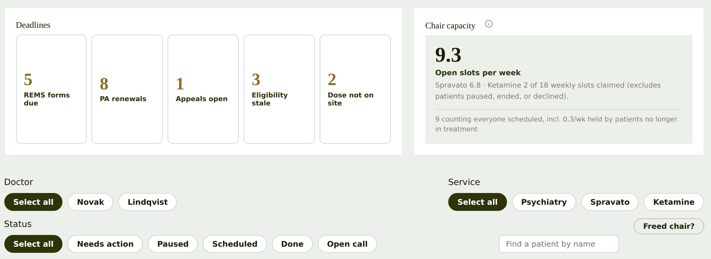
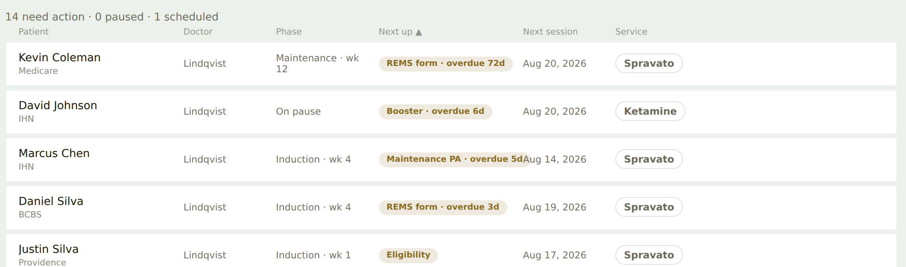
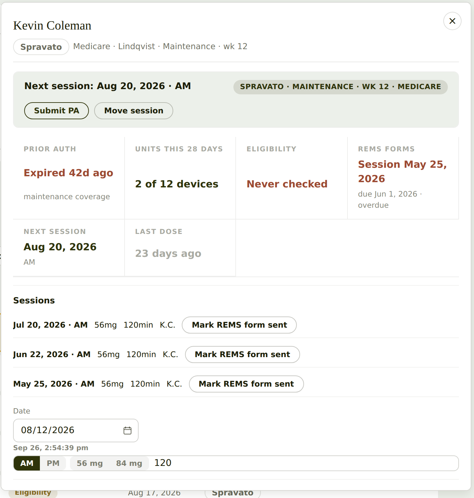
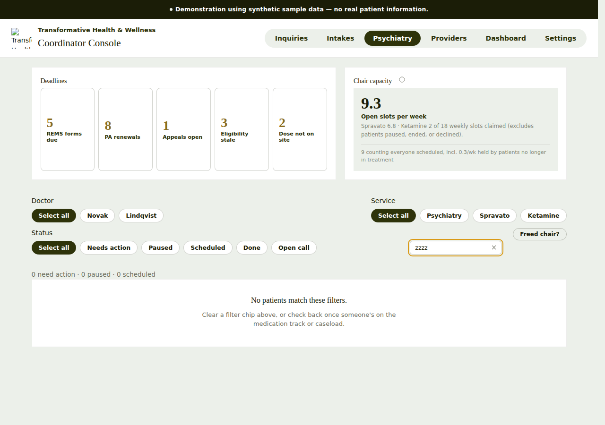
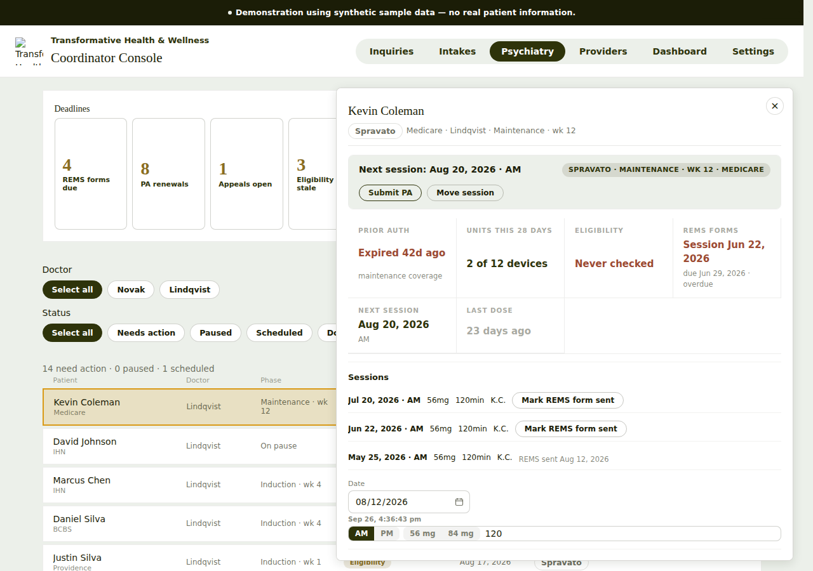

# Psychiatry tab: UI/UX review

**App:** Coordinator Console (`transformative-coordinator-console.vercel.app`), production deployment `dpl_C7rhQMfLtYPNgNEJVrYD3ezYyQk2`
**Date:** 2026-09-26
**How it was reviewed:** The built bundle was downloaded through the Vercel connector, served locally, and driven with headless Chromium at 1280×900 (desktop) and 390×844 (phone). All data is the app's synthetic demo data.

> The logo and web fonts returned 404 in the local copy, so the broken logo image and serif fallback fonts in the screenshots come from how I rendered it. They are **not** findings.

---

## TL;DR: the top 5

1. **The numbers disagree with each other.** The "REMS forms due" tile says **5**, but clicking it filters the list to **2** patients. The summary line says **"0 paused"** while David Johnson's row says **"On pause"**. A coordinator will stop trusting the counts.
2. **The app has two different "todays".** The demo runs on **Aug 12** (the date picker, "Submitted Aug 12", "REMS sent Aug 12"), but the session entry row prints the real clock ("Sep 26, 4:36 pm"). The stray real timestamp makes every August date look stale. *(Corrected: the first pass called the August next-session dates a bug. They aren't, because they're in the future on the demo clock.)*
3. **Every overdue item looks the same.** "REMS form · overdue **72d**", "overdue 3d" and "Maintenance PA · 2d" all use the same beige pill. The most important signal on the page, what's on fire, has no color or weight difference.
4. **One-click actions save instantly, with no confirmation and no validation.** "Submit PA" marks the PA submitted immediately. Pressing Enter in the session row logged a session of **−5 minutes with no dose**. Neither shows an undo. *(Corrected: the first pass said rows weren't reachable by keyboard. They are, because a nested button receives Tab focus.)*
5. **The patient drawer covers the list with no backdrop, and its entry form has no labels.** A bare "120" input, AM/PM and mg toggles, and a stray timestamp ("Sep 26, 2:53:15 pm") sit at the bottom with no heading or save button. Three identical "Mark REMS form sent" buttons don't show which one is actually overdue.

---

## Findings, ranked

### 🔴 High

| # | Where | What I saw | Fix |
|---|---|---|---|
| H1 | Deadline tiles → list | The tile says **5 REMS forms due**. Clicking it shows *"2 need action · 0 paused · 1 scheduled"* with only 2 REMS rows. | The tile count and the filtered list must use the same query. If the tile counts something different (for example per session instead of per patient), label it that way ("5 forms · 2 patients"). |
| H2 | Summary line vs rows | *"14 need action · 0 paused · 1 scheduled"*, but David Johnson's phase is **On pause**. | Count paused patients by phase, or rename the phase so the two don't contradict each other. |
| ~~H3~~ | ~~Next session dates in the past~~ | **Withdrawn.** The demo clock is Aug 12, so these dates are upcoming. The real issue is the stray real-time timestamp; see I1. | — |
| ~~H4~~ | ~~Rows not keyboard reachable~~ | **Withdrawn.** Tab reaches every row through its inner button. | — |
| H5 | "Next up" pills | Overdue by 72 days, overdue by 3 days, and due in 2 days all share one style. | Use 3 levels. **Overdue** is solid clay with white text, **≤ 7 days** is the accent color, and anything later stays muted. Sort by severity, then by date. |

### 🟠 Medium

| # | Where | What I saw | Fix |
|---|---|---|---|
| M1 | Drawer | It opens over the right half of the list with no backdrop. The selected row is half hidden. I didn't see a focus trap. | Add a backdrop, or push the list over. Move focus into the drawer when it opens and return it to the row when it closes. Use `role="dialog"`, `aria-modal` and a labelled title. |
| M2 | Drawer, session entry row | It has an unlabeled "120" input, AM/PM, 56 mg or 84 mg, and a raw timestamp. There's no heading and no **Save** button. | Title it "Log a session" and label every input (Date, Time, Dose, Minutes observed). Add an explicit **Save session** button and a confirmation. Remove the stray timestamp or label it ("Last edited …"). |
| M3 | Drawer, sessions list | There's a "Mark REMS form sent" button on all 3 sessions, and only one is flagged overdue in the summary. | Put the button only on sessions that still owe a form, and mark the overdue one in red with "overdue since Jun 1". Show a ✓ with the date on ones already sent. |
| M4 | Drawer action bar | The "Submit PA" and "Move session" buttons have equal weight, but the PA **expired 42 days ago** and eligibility was **never checked**. | Make the most urgent fix the primary button (filled accent), such as **Renew PA**, and add "Check eligibility". Show the reason next to it. |
| M5 | Chair capacity card | "**9.3** open slots per week", "Spravato 6.8", "0.3/wk held by…" | Fractions of a chair confuse people. Show whole slots ("9 open this week, 7 Spravato · 2 Ketamine") and put the averaging explanation behind the ⓘ. |
| M6 | "Freed chair?" chip | The label is cryptic. It toggles to "Hide freed-chair list", and the panel also has its own **Close** button. | Rename it **"Fill an open chair"**. Use one control to open and close it. Explain the list ("patients who can take a same-day opening, soonest first"). |
| M7 | Filter chips | "Select all" appears three times, and on its own it reads like a command. | Use an **All** chip, or show a count ("Doctor: All ▾"). Also consider collapsing the three rows of chips into a single filter bar. |

### 🟡 Low

| # | Where | What I saw | Fix |
|---|---|---|---|
| L1 | Deadline tiles | They're 170px tall with the number and label floating in empty space. | Make them about 80px tall with the number and label on one line. That brings the queue above the fold. |
| L2 | Name search | It floats on its own mid-right, under the Service chips. | Put it at the left of the filter bar, where it's scanned first. |
| L3 | Header column labels | They're 11px and light grey, and only "Next up ▲" shows it's sortable. | Show a sort affordance on all sortable headers and darken the header text. |
| L4 | Phone, sticky banner | The 2-line synthetic-data banner stays pinned and covers content while scrolling (see `05-mobile-list.png`). | On phones, don't make it sticky, or shorten it to one line ("Demo data"). |
| L5 | Phone, first screen | The whole first screen is tiles and the capacity card, and no patients show without scrolling. | On narrow screens, collapse the tiles into a horizontal strip and start with the list. |
| L6 | Phone, row layout | The pill wraps onto its own line next to the date, so row heights vary. | Use a fixed 2-line layout: name + service on line 1, next-up pill + date on line 2. |

---

---

## Interaction pass (clicking everything)
Every control on the tab was exercised in headless Chromium. Each claim below is something I observed, not something read from the code.

### What works well ✅
- **The tiles work as toggles.** Clicking "PA renewals" filters the list to 8 patients (7 need action + 1 scheduled, which matches the tile). Clicking it again clears the filter, and clicking a different tile swaps to that filter.
- **"Mark REMS form sent" updates everything right away.** It marks the oldest session "REMS sent Aug 12", the tile drops from 5 to 4, and the row pill updates to "overdue 44d".
- **The drawer is solid to navigate.**
  - Esc closes it, and so does clicking outside.
  - Focus moves to the patient's name when it opens.
  - Clicking another row while it's open swaps to that patient.
  - There's a "‹ Back to list" button.
- **Search and chip filters** have a real empty state ("No patients match these filters").

### New problems found
| # | Sev | Action | What happened | Fix |
|---|---|---|---|---|
| I1 | 🔴 | Session entry row | It prints the real clock "Sep 26, 4:36 pm" while the whole app runs on Aug 12. | Remove it, or use the app clock. |
| I2 | 🔴 | Type −5 in minutes, press Enter | This **logged a session with −5 min and no dose**. There's no validation and no Save button, only Enter. | Require a dose and minutes > 0, add a **Save session** button, and show an undo toast. |
| I3 | 🔴 | **Submit PA** | One click, and the PA shows "Submitted Aug 12". There's no confirmation, the button disappears, and I saw no undo. | Confirm first ("Submit PA for Kevin Coleman to Medicare?"), or show a 5-second undo toast. |
| I4 | 🟠 | **Move session** | Nothing visibly happens. The slot picker expands about 500px below the fold, the scroll stays at the top, and focus stays on the button. | Scroll to the picker and move focus to it, or open it in place. |
| I5 | 🟠 | Move session slots | It says "1.5 chairs free", listing 8 slots that work and then 6 that don't. | Use whole chairs, list only the slots that work (hide the rest behind "show unavailable"), and make slots tappable with a clear selected state. |
| I6 | 🟠 | **Paused** filter | It shows 0 patients, but David Johnson is "On pause". | This confirms H2. Match the filter to the phase. |
| I7 | 🟠 | Search "coleman kevin" | No match; only "first last" works. | Match each word separately in any order. Also match the payer and doctor. |
| I8 | 🟠 | Empty state | It says "Clear a filter chip above", but the cause was the search text and there's no clear button. | Name the active filters and add a **Clear all filters** button. |
| I9 | 🟡 | Doctor **Novak**, service **Psychiatry**, status **Open call** | Each shows 0 patients. | Hide chips with no results, or show counts on them ("Novak 0"). |
| I10 | 🟡 | **Show Done (3)** | It adds 3 rows, but the summary line still says "14 · 0 · 1". | Add "3 done" to the summary when Done rows are shown. |
| I11 | 🟡 | Column headers | Patient, Phase, Next up and Next session sort. **Doctor and Service don't.** Only the active column shows ▲. | Make all columns sortable or none, and show a faint ↕ on the sortable ones. |
| I12 | 🟡 | The ⓘ next to Chair capacity | It's a button with **no accessible name**, so screen readers just say "button". | `aria-label="How chair capacity is calculated"` |
| I13 | 🟡 | Minutes field | It has only placeholder text, no label. The drawer also has a heading **"Log a call" and a button "Log a call"** next to each other. | Label the field and rename one of the two. |
| I14 | 🟡 | Drawer | It's an `<aside>` with no `role="dialog"` or `aria-modal`. | Add them; focus management is already there. |
| I15 | 🟡 | "Eligibility checked today" | It's a single-tap button that records a fact, while the summary above says "Never checked". | Confirm it, or show the date after tapping. |

---

## Visual review (layout, type, color, spacing)
Based on 2× crops: `06-zoom-top.png`, `07-zoom-rows.png` and `08-zoom-drawer.png`.

### Top band (deadline tiles and chair capacity)
- **The tiles are mostly empty space.** Each one is about 170px tall with a small number and label floating in it. The numbers also sit at **different heights**: 5, 3 and 2 ride higher than 8 and 1 because their labels wrap onto two lines. Anchor the number and label to the top-left, or put them on one line, and cut the tile height by about half.
- **The gold numbers are low-contrast and their meaning is unclear.** The same gold (`--accent`) is used for the counts, the "Next up" pills and the focus ring. Pick one job for it: use it for urgency, or don't use it at all.
- **The corners don't match.** The tiles have 8px rounded corners but sit inside a square card (`--radius-card: 0`), next to pill-shaped chips. Choose one radius per level.
- **The tiles are clickable buttons but look like static boxes.** They need a hover and pressed state, and a selected state when they're filtering the list.
- **The hierarchy is inverted.** "Deadlines" and "Chair capacity" are small serif titles, while the filter labels "Doctor" and "Status" below them are larger and darker. Section titles should outrank filter labels.
- **The capacity card is grey text on grey.** The explanation lines are too pale to read comfortably, and the "9.3" is the loudest thing on the page for the least actionable number.

### Filter area
- **The filters are scattered.** Doctor sits at the left edge, Service at the right edge, "Freed chair?" floats alone, and the search box lines up with neither column. It reads as four separate islands. Put them in one row or bar: search, then Doctor, Service and Status as dropdowns.
- **The default state gets the heaviest ink on the page.** Three solid dark "Select all" pills stand out most, but they show that *nothing* is filtered. Make the default quiet and the active filter loud.

### Queue rows
- **Text overlaps.** The "Maintenance PA · overdue 5d" pill runs into "Aug 14, 2026". The column is too narrow for the longest pill. Give the column a minimum width or let the pill truncate with a tooltip.
- **The phase text wraps awkwardly.** "Maintenance · wk" / "12" splits across two lines. Keep "wk 12" together with a non-breaking space, or show the week as a small second line.
- **About 30% of each row's width is empty.** Everything after the Service pill is blank white. Widen Patient and Next up, or narrow the container.
- **The Service pill looks like a button.** It's an outlined, bold pill, but it isn't clickable. Use a flat tag or a colored dot.
- **The column headers are almost invisible.** They're 11px pale grey. Darken them a step.
- **Rows are hard to scan.** Every row carries the same weight and the grey gaps between them are thick. Try tighter rows with hairline dividers, and a clay-colored left edge on overdue rows.

### Patient drawer
- **The hierarchy is flipped here too.** The patient's name is a thin serif, and the bold sans "Next session: Aug 20, 2026 · AM" under it overpowers it. The name should be the anchor.
- **The same facts appear twice.** The subtitle "Spravato · Medicare · Lindqvist · Maintenance · wk 12" is repeated in the uppercase chip "SPRAVATO · MAINTENANCE · WK 12 · MEDICARE". Drop the chip.
- **The stat grid is uneven.**
  - The values sit at different heights: "Expired 42d ago" is higher than "2 of 12 devices" and "Never checked".
  - The second row has only 2 of 4 cells filled, leaving a hole.
  - "Next session" is repeated a third time.
  - Fix: top-align all the values and use a 3-column grid without the repeat.
- **The label color is too pale.** The uppercase, letter-spaced labels (PRIOR AUTH and the others) are too light, and "23 days ago" in grey looks disabled.
- **Red is used for three different kinds of problem.** Expired PA, never checked and the REMS form are all the same red, so nothing is ranked. Keep solid red for the one blocking item.
- **The session entry row looks broken.**
  - The AM/PM and mg toggles are fused into the "120" input as one long pill.
  - The date box has a different width and height from everything else.
  - A bold timestamp floats between them.
  - Fix: separate the fields with labels and give them consistent heights.
- **The drawer bottom is cut off.** The list rows bleed through under the drawer's bottom edge. The drawer needs full height or its own scroll area, with a solid footer.

### Overall
The palette (moss, sage, clay, gold) and the serif and sans pairing are good and on-brand. The problems are consistency (radius, weight, where color is used) and hierarchy (loud defaults, quiet urgencies). Fix those and it will look noticeably more polished without a redesign.

## Quick wins (under an hour each)
- [ ] Make tile counts and filtered list counts come from the same selector (H1, H2).
- [ ] Remove the stray real-clock timestamp (I1).
- [ ] Validate the session row and add Save and undo (I2), and add confirm or undo to Submit PA (I3).
- [ ] Give overdue pills a clay or red style (H5).
- [ ] Make Move session scroll to and focus its picker (I4).
- [ ] Label the session-entry inputs and add a Save button (M2).
- [ ] Rename "Freed chair?" to "Fill an open chair", and "Select all" to "All" (M6, M7).

## Screenshots
| | |
|---|---|
| Desktop, tab landing |  |
| Patient drawer |  |
| Freed-chair panel |  |
| Phone, top |  |
| Phone, list |  |
| Zoom: top band |  |
| Zoom: rows |  |
| Zoom: drawer |  |
| Empty state |  |
| After Mark REMS sent |  |

## Not checked
- Color contrast was judged by eye and not measured.
- Screen-reader output and focus order inside the drawer weren't tested.
- The other tabs (Inquiries, Intakes, Providers, Dashboard, Settings) weren't reviewed.
