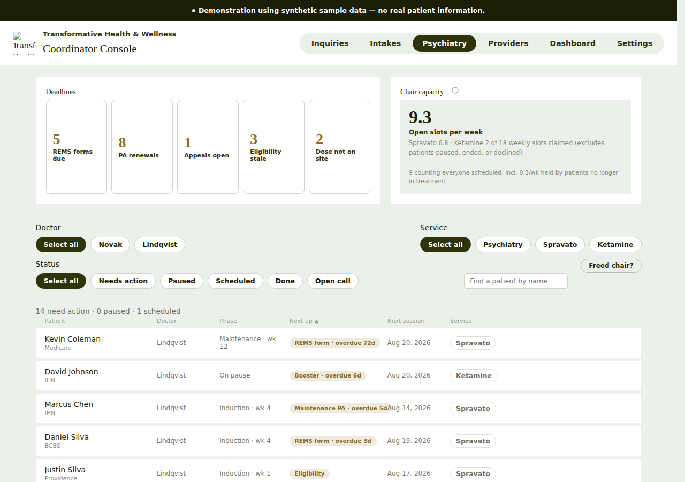
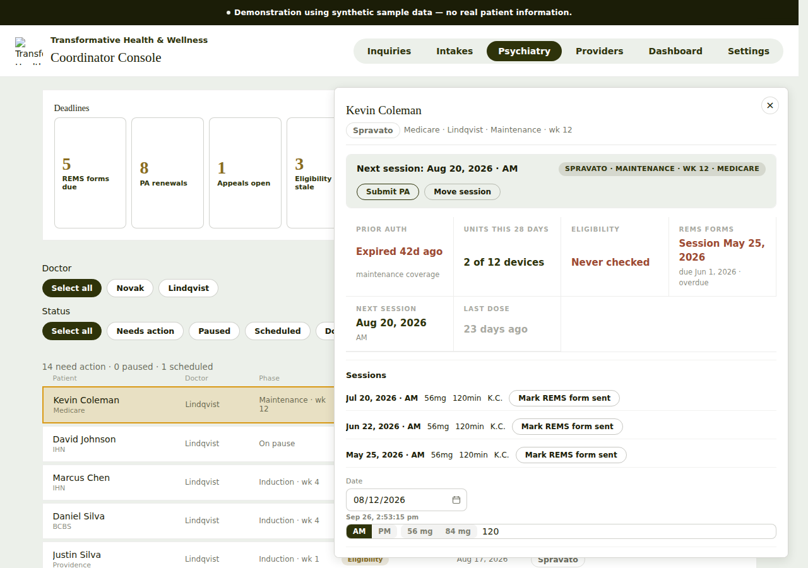
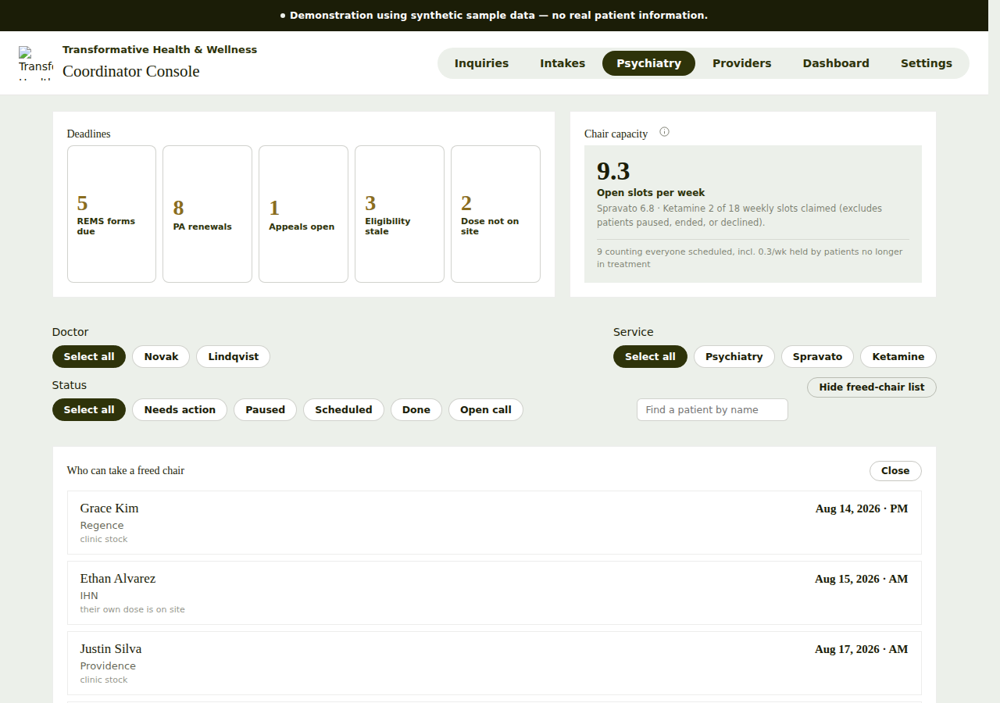
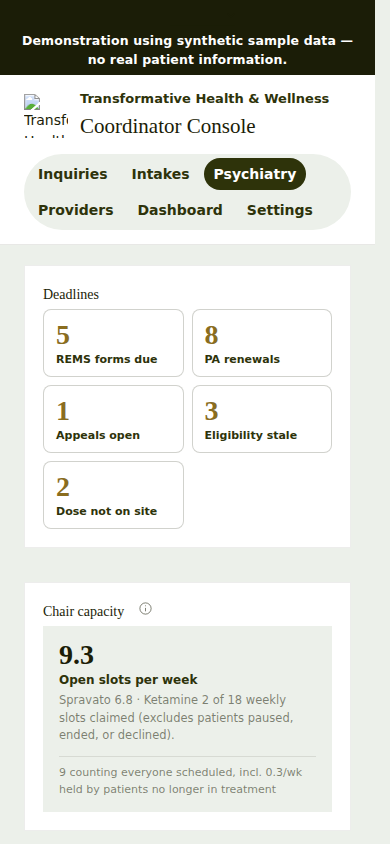
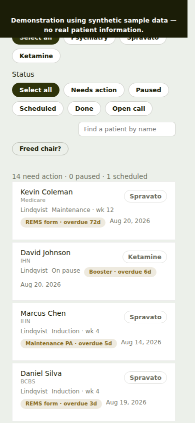

# Psychiatry tab: UI/UX review

**App:** Coordinator Console (`transformative-coordinator-console.vercel.app`), production deployment `dpl_C7rhQMfLtYPNgNEJVrYD3ezYyQk2`
**Date:** 2026-09-26
**How it was reviewed:** The built bundle was downloaded through the Vercel connector, served locally, and driven with headless Chromium at 1280×900 (desktop) and 390×844 (phone). All data is the app's synthetic demo data.

> The logo and web fonts returned 404 in the local copy, so the broken logo image and serif fallback fonts in the screenshots come from how I rendered it. They are **not** findings.

---

## TL;DR: the top 5

1. **The numbers disagree with each other.** The "REMS forms due" tile says **5**, but clicking it filters the list to **2** patients. The summary line says **"0 paused"** while David Johnson's row says **"On pause"**. A coordinator will stop trusting the counts.
2. **"Next session" dates are in the past.** The drawer's clock reads Sep 26, but every "Next session" is in August (for example Kevin Coleman shows *Next session: Aug 20*). A past date labeled "next" needs to say *Missed / not rebooked*.
3. **Every overdue item looks the same.** "REMS form · overdue **72d**", "overdue 3d" and "Maintenance PA · 2d" all use the same beige pill. The most important signal on the page, what's on fire, has no color or weight difference.
4. **You can't open a patient with the keyboard.** Queue rows are `
`s with `tabIndex -1`, with no role and no button. Tab skips the whole patient list.
5. **The patient drawer covers the list with no backdrop, and its entry form has no labels.** A bare "120" input, AM/PM and mg toggles, and a stray timestamp ("Sep 26, 2:53:15 pm") sit at the bottom with no heading or save button. Three identical "Mark REMS form sent" buttons don't show which one is actually overdue.

---

## Findings, ranked

### 🔴 High

| # | Where | What I saw | Fix |
|---|---|---|---|
| H1 | Deadline tiles → list | The tile says **5 REMS forms due**. Clicking it shows *"2 need action · 0 paused · 1 scheduled"* with only 2 REMS rows. | The tile count and the filtered list must use the same query. If the tile counts something different (for example per session instead of per patient), label it that way ("5 forms · 2 patients"). |
| H2 | Summary line vs rows | *"14 need action · 0 paused · 1 scheduled"*, but David Johnson's phase is **On pause**. | Count paused patients by phase, or rename the phase so the two don't contradict each other. |
| H3 | Next session column + drawer | Today is Sep 26, but all next sessions are Aug 14–20. | If the date is before today, show **"Missed Aug 20 · rebook"** in clay or red and sort it as needing action. |
| H4 | Queue rows | `DIV`, no `role`, `tabIndex = -1`. There are 41 buttons in the tab, but no patient row is one of them. | Make each row a `<button>` (the other tabs already use `.queue-row` as a button) or a link, with `aria-label="Open Kevin Coleman"`. |
| H5 | "Next up" pills | Overdue by 72 days, overdue by 3 days, and due in 2 days all share one style. | Use 3 levels. **Overdue** is solid clay with white text, **≤ 7 days** is the accent color, and anything later stays muted. Sort by severity, then by date. |

### 🟠 Medium

| # | Where | What I saw | Fix |
|---|---|---|---|
| M1 | Drawer | It opens over the right half of the list with no backdrop. The selected row is half hidden. I didn't see a focus trap. | Add a backdrop, or push the list over. Move focus into the drawer when it opens and return it to the row when it closes. Use `role="dialog"`, `aria-modal` and a labelled title. |
| M2 | Drawer, session entry row | It has an unlabeled "120" input, AM/PM, 56 mg or 84 mg, and a raw timestamp. There's no heading and no **Save** button. | Title it "Log a session" and label every input (Date, Time, Dose, Minutes observed). Add an explicit **Save session** button and a confirmation. Remove the stray timestamp or label it ("Last edited …"). |
| M3 | Drawer, sessions list | There's a "Mark REMS form sent" button on all 3 sessions, and only one is flagged overdue in the summary. | Put the button only on sessions that still owe a form, and mark the overdue one in red with "overdue since Jun 1". Show a ✓ with the date on ones already sent. |
| M4 | Drawer action bar | The "Submit PA" and "Move session" buttons have equal weight, but the PA **expired 42 days ago** and eligibility was **never checked**. | Make the most urgent fix the primary button (filled accent), such as **Renew PA**, and add "Check eligibility". Show the reason next to it. |
| M5 | Chair capacity card | "**9.3** open slots per week", "Spravato 6.8", "0.3/wk held by…" | Fractions of a chair confuse people. Show whole slots ("9 open this week, 7 Spravato · 2 Ketamine") and put the averaging explanation behind the ⓘ. |
| M6 | "Freed chair?" chip | The label is cryptic. It toggles to "Hide freed-chair list", and the panel also has its own **Close** button. | Rename it **"Fill an open chair"**. Use one control to open and close it. Explain the list ("patients who can take a same-day opening, soonest first"). |
| M7 | Filter chips | "Select all" appears three times, and on its own it reads like a command. | Use an **All** chip, or show a count ("Doctor: All ▾"). Also consider collapsing the three rows of chips into a single filter bar. |

### 🟡 Low

| # | Where | What I saw | Fix |
|---|---|---|---|
| L1 | Deadline tiles | They're 170px tall with the number and label floating in empty space. | Make them about 80px tall with the number and label on one line. That brings the queue above the fold. |
| L2 | Name search | It floats on its own mid-right, under the Service chips. | Put it at the left of the filter bar, where it's scanned first. |
| L3 | Header column labels | They're 11px and light grey, and only "Next up ▲" shows it's sortable. | Show a sort affordance on all sortable headers and darken the header text. |
| L4 | Phone, sticky banner | The 2-line synthetic-data banner stays pinned and covers content while scrolling (see `05-mobile-list.png`). | On phones, don't make it sticky, or shorten it to one line ("Demo data"). |
| L5 | Phone, first screen | The whole first screen is tiles and the capacity card, and no patients show without scrolling. | On narrow screens, collapse the tiles into a horizontal strip and start with the list. |
| L6 | Phone, row layout | The pill wraps onto its own line next to the date, so row heights vary. | Use a fixed 2-line layout: name + service on line 1, next-up pill + date on line 2. |

---

## Quick wins (under an hour each)
- [ ] Make tile counts and filtered list counts come from the same selector (H1, H2).
- [ ] Past "next session" dates show as **Missed** (H3).
- [ ] Give overdue pills a clay or red style (H5).
- [ ] Make rows `<button>`s (H4).
- [ ] Label the session-entry inputs and add a Save button (M2).
- [ ] Rename "Freed chair?" to "Fill an open chair", and "Select all" to "All" (M6, M7).

## Screenshots
| | |
|---|---|
| Desktop, tab landing |  |
| Patient drawer |  |
| Freed-chair panel |  |
| Phone, top |  |
| Phone, list |  |

## Not checked
- Color contrast was judged by eye and not measured.
- Screen-reader output and focus order inside the drawer weren't tested.
- The other tabs (Inquiries, Intakes, Providers, Dashboard, Settings) weren't reviewed.
